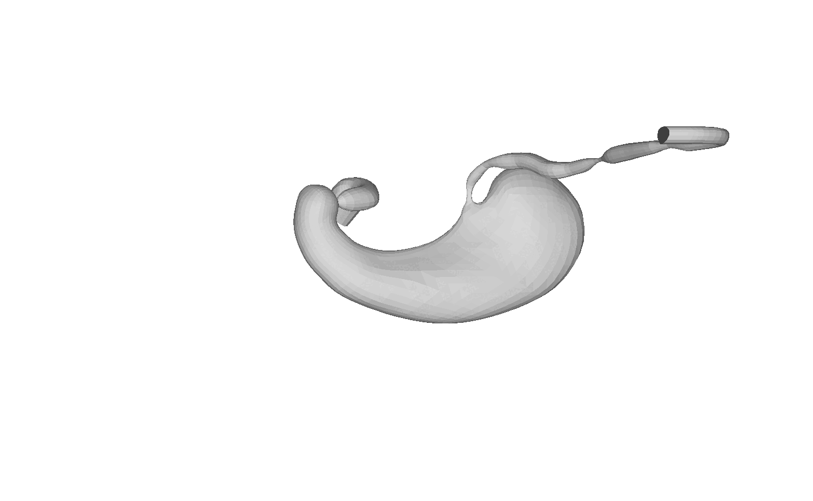
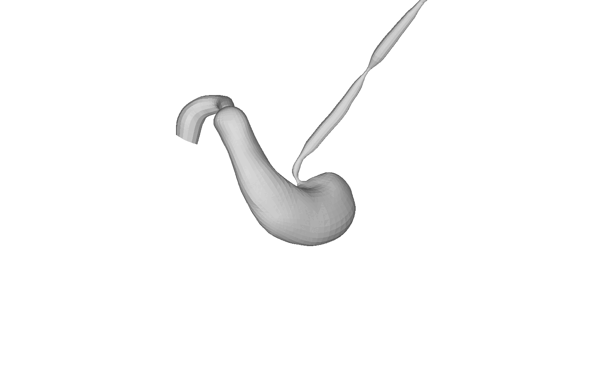

# A Statistical 3D Stomach Shape Model for Anatomical Analysis (PyTorch)

> ⚠️ The repository containing the full implementation code is available here:  
> [https://gitlab.com/Erez.Posner/stomach_pytorch](https://gitlab.com/Erez.Posner/stomach_pytorch)


<p align="center">
   
  
</p>

## License

S3M is available under the [Creative Commons Attribution license](https://creativecommons.org/licenses/by/4.0/). By using the model or the code, you acknowledge that you have read and agree to the license terms. If you do not agree with these terms and conditions, you must not use the code.

## Referencing S3M

When using this code or model in a scientific publication, please cite:

```bibtex
@article{S3M2025,
  title = {A Statistical 3D Stomach Shape Model for Anatomical Analysis},
  author = {Your Name and Collaborators},
  journal = {Journal/Conference Name},
  volume = {XX},
  number = {XX},
  year = {2025},
  url = {https://doi.org/your-doi}
}
```

