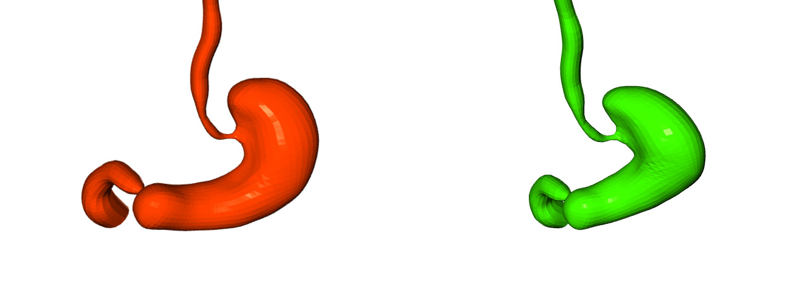

# S3M: Statistical 3D Stomach Shape Model (PyTorch)

This is an implementation of **S3M** in PyTorch. S3M is a statistical shape model of the stomach built from a dataset of 3D scans, designed to capture natural anatomical variability in a low-dimensional shape space. The model offers an efficient and expressive representation of stomach anatomy for research and clinical applications.

<p align="center"> 
  
</p>

S3M is a lightweight model that encapsulates the diverse anatomical variations observed in the stomach. By leveraging accurate alignments from 3D scans, the model facilitates advanced analysis and simulation of stomach morphology.

## Installation

The code uses **Python 3.9** and has been tested on PyTorch 1.13.

### Setup S3M PyTorch Virtual Environment

```shell
conda create -n stomach_pytorch python=3.9
conda activate stomach_pytorch
```

### Clone the Project and Install Requirements

```shell
git clone https://github.com/erezposner/STOMACH_pytorch
cd S3M_PyTorch
pip install poetry
poetry install
```

## Demo

### Visualizing 3D Variations of the Stomach

Run the following command from the terminal to load S3M and visualize the 3D shape variations:

```shell
python main.py
```
## Synthetic Dataset
dataset will be published soon!
### Stomach Pipeline Generation

#### Pipeline parameters details
Stomach pipeline generation operation parameters with their respective ranges and descriptions.

The detailed parameter table is available here:  
[pipeline_parameters.csv](images/pipeline_parameters.csv)

The template mesh creation is shown here: 
the pipeline interactive mode enables interpolating between different morphologies as well as condition on dimensional parameters, including Greater Curvature length (GC), Lesser Curvature length (LC), and the stomach volume.


Multiple synthetic stomach variation are visualized here: 
## License

S3M is available under the [Creative Commons Attribution license](https://creativecommons.org/licenses/by/4.0/). By using the model or the code, you acknowledge that you have read and agree to the license terms. If you do not agree with these terms and conditions, you must not use the code.

## Referencing S3M

When using this code or model in a scientific publication, please cite:

```bibtex
@article{S3M2025,
  title = {A Statistical 3D Stomach Shape Model for Anatomical Analysis},
  author = {Your Name and Collaborators},
  journal = {Journal/Conference Name},
  volume = {XX},
  number = {XX},
  year = {2025},
  url = {https://doi.org/your-doi}
}
```

